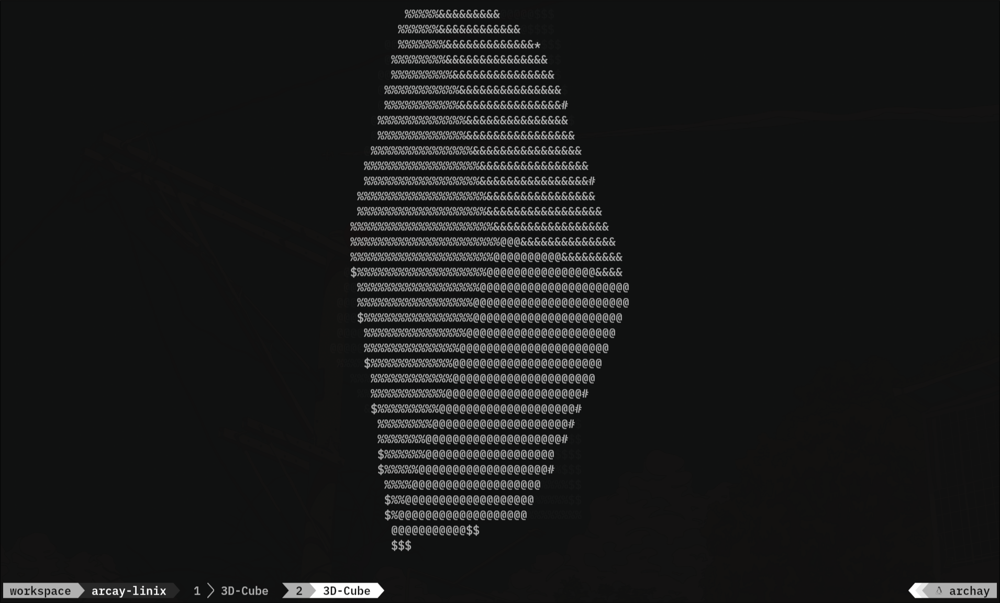
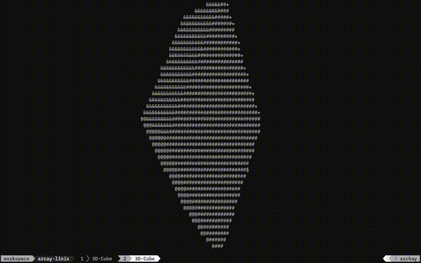

# ASCII Spinning Cube

A 3D cube rendered and spun in your terminal using ASCII characters, written in Go.



## Why I decided to build this

First I learned Go, then I thought maybe I should build something to see if I actually understand it. I was also interested in this specific project — a spinning ASCII cube — because I'd seen people build it on YouTube. This is the first real program I built entirely by hand, writing all the code myself.

```bash
git clone https://github.com/lazysal5489/3D-Ascii-Cube.git
cd 3D-Ascii-Cube
go run main.go
```

## How it works

Under the hood, the cube uses rotation matrices to compute vertex positions each frame, then projects them to 2D and maps depth to ASCII characters.

## Feature

- Renders a rotating 3D cube using only ASCII characters
- Real-Time rotation on X,Y and Z axis
- Depth-based shading using different ASCII characters for near/far surfaces
- Run entirely in terminal, no graphic library needed

## Technology

- Written in pure Go with no external dependencies
- Uses trigonometric rotation to rotate cube vertex each frame
- Project 3D coordinate to 2d screen space using perspective projection
- Maps surface depth (z-value) to ASCII characters (e.g, '@', '#', '%', '*', '&', '$') to simulate shading

## Possible Improvements

- Add color to each side of cube. (Already implement it )

## Conclusion

Building this project was so much fun, and I also learned new stuff too. I really enjoyed using Go

## Demo



## Reminder English is not my first language
